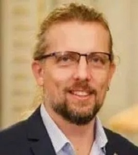

<link rel="stylesheet" href="styles.css" type="text/css">

  
    

:::: {style="display: flex;"}

::: {.column width="35%"}

:::

::: {.column width="10%"}
\ 
<!-- an empty Div (with a whitespace), serving as
a column separator -->
:::

::: {.column width="55%"}
### **Assoc. Prof. Antoniade-Ciprian ALEXANDRU-CARAGEA PhD**  
*Vice Rector  
Scientific Research and International Relations  
Ecological University of Bucharest*  

Ciprian ALEXANDRU PhD., Associate Professor at the Ecological University of Bucharest and Vice-rector on Research activities. He was invited as Keynote speaker with the topic “Reproducible Research with R”, in 2015, to the International Conference on Computing, Mathematics and Statistics (iCMS2015) Malaysia.  

As a trainer of National Institute of Statistics, he worked with various private clients, like telecom and banking industries, but also with public institutions, into training on the job system, starting from understanding their data and the business itself, identifying their needs for analyzing the data, to building models. Training activities held in National Centre for Training in Statistics from Bucharest: “Data Analysis in Statistics with R”; “The course Introduction to Statistics - Applications in R”; “R Statistical Software – Presenting Advantages of its use for Data Analysis”; “Statistical Analysis – from Theory to Practice”; “Concepts, Models and Techniques for Data Analysis” [http://r-project.ro/training.html](http://r-project.ro/training.html). He worked as a trainer for EUROSTAT and UNDP.  

He participated in various research projects (including Eurostat), workshops, national and international conferences. His research activity was commissioned in value by publishing studies in journals in Romania and in Europe, as well as in international databases (ISI Thomson, DOAJ, EBSCO, RePEc. His research papers and articles are also published in prestigious peer-reviewed publications.  

:::

::::

> Plenary  
> Assoc. Prof. Antoniade-Ciprian ALEXANDRU-CARAGEA Ph will be presenting on 'Smartcity Development and Implementation in Romania' on 4th August 2021 at 15:30 (MALAYSIA time) during the 5th International Conference on Computing, Mathematics and Statistics 2021 (iCMS2021).  
>  
> [[Find out more]](plenaries.html)
