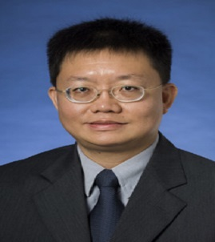

<link rel="stylesheet" href="styles.css" type="text/css">

  
    

:::: {style="display: flex;"}

::: {.column width="35%"}

:::

::: {.column width="10%"}
\ 
<!-- an empty Div (with a whitespace), serving as
a column separator -->
:::

::: {.column width="55%"}
### **Dr. Gerald Cheang**  
*Senior Lecturer  
UniSA: STEM  
Centre for Industrial and Applied Mathematics  
University of South Australia*  

Dr Gerald Cheang is currently Senior Lecturer at UniSA: STEM at the University of South Australia in Adelaide. He completed his BSc (Hon) degree at Auckland University and obtained his MA PhD at Yale University. His research interests are in the areas of Financial Mathematics, Stochastic Processes, Financial Economics and Approximation Theory. Prior to his appointment at the University of South Australia, he has taught at the National Institute of Education and at the Nanyang Business School (Nanyang Technological University) in Singapore. He has authored research articles in journals such as the Journal of Approximation Theory, Applied Mathematical Finance, Quantitative Finance and the International Journal of Theoretical and Applied Finance. He also supervises doctoral candidates in the area of Financial Mathematics at the University of South Australia. He is also associated with the Centre for Industrial and Applied Mathematics at the University of South Australia.  

:::

::::

> Plenary  
> Dr. Geral Cheang will be presenting on 'A History of Exchange Option Pricing Models' on 5th August 2021 at 10:15 (MALAYSIA time) during the 5th International Conference on Computing, Mathematics and Statistics 2021 (iCMS2021).  
>  
> [[Find out more]](plenaries.html)
