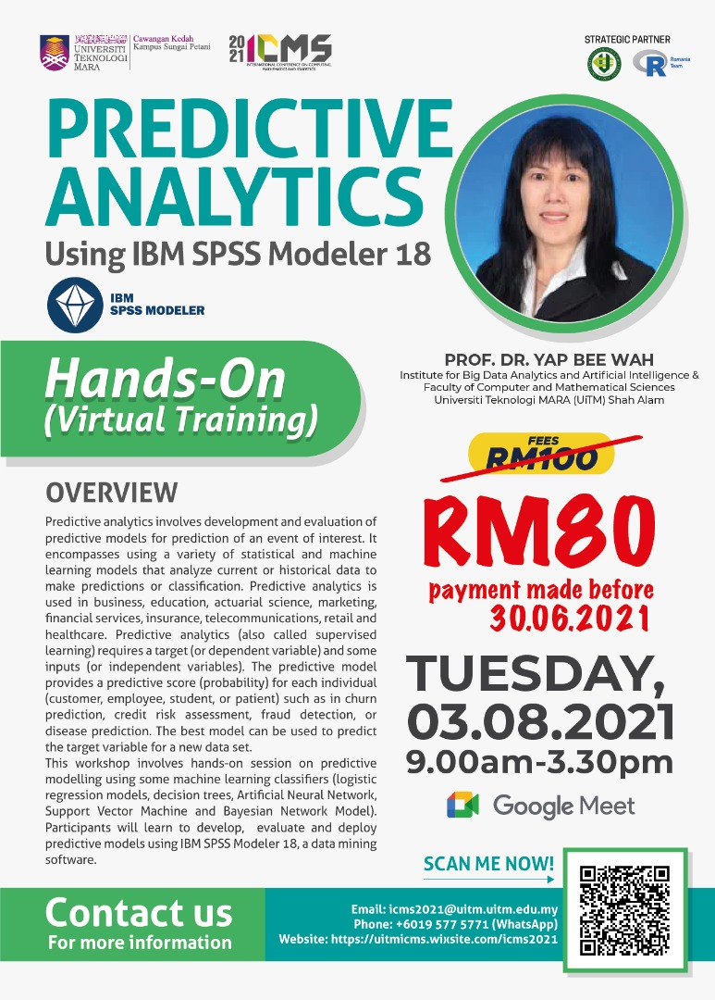
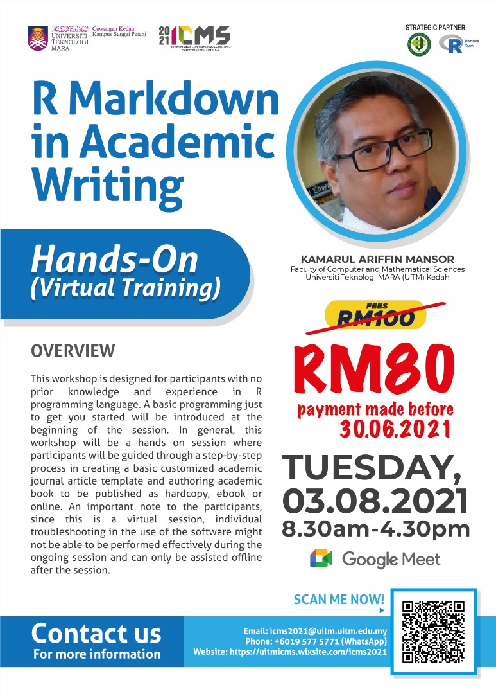

<link rel="stylesheet" href="styles.css" type="text/css">
 

    

### **3th August, 2021**  
### **08:30 - 16:30 (MY time)**  

Select a workshop session below to reveal more details and to access the button to join.  

***  

> ### WORKSHOP 1  
> #### **PREDICTIVE ANALYTICS USING IBM SPSS MODELER 18**  
> Presented by: Prof. Dr. Yap Bee Wah  
> 
> IBM SPSS Modeler @ [https://www.ibm.com/products/spss-modeler](https://www.ibm.com/products/spss-modeler)  

Overview & Tentative
 

  

<aside style="width:20%; height:30%; float:right" align="center">

</aside>  

Predictive analytics involves development and evaluation of predictive models for prediction of an event of interest. It encompasses using a variety of statistical and machine learning models chat analyze current or historical data to make predictions or classification. Predictive analytics is used in business, education, actuarial science, marketing, financial services, insurance, telecommunications, retail and healthcare. Predictive analytics {also called supervised learning) requires a target (or dependent variable) and some inputs (or independent variables). The predictive model provides a predictive score {probability) for each individual (customer, employee, student, or patient) such as in churn prediction, credit risk assessment, fraud detection, or disease prediction. The best model can be used to predict the target variable for a new data set.  

This workshop involves hands-on session on predictive modelling using some machine learning classifiers {logistic regression models, decision trees, Artificial Neural Network, Support Vector Machine and Bayesian Network Model). Participants will learn to develop, evaluate and deploy predictive models using IBM SPSS Modeler 18, a data mining software.    
  
[**Prof. Dr Yap Bee Wah, Malaysia**](keynote1.html)  

[[Join]]()  

  

  

***  

> ### WORKSHOP 2  
> #### **R Markdown in Academic Writing**  
> Presented by: Kamarul Ariffin Mansor  
> 
> R Software @ [https://cran.r-project.org/](https://cran.r-project.org/)  
> R Studio @ [https://www.rstudio.com/](https://www.rstudio.com/)  

Overview & Tentative

  

<aside style="width:20%; height:30%; float:right" align="center">

</aside>  

This workshop is designed for participants with no prior knowledge and experience in R programming language. A basic programming just to get you started will be introduced at the beginning of the session. In general, this workshop will be a hands on session where participants will be guided through a step-by-step process in creating a basic customized academic journal article template and authoring academic book to be published as hardcopy, ebook or online. An important note to the participants, since this is a virtual session, individual troubleshooting in the use of the software might not be able to be performed effectively during the ongoing session and can only be assisted offline after the session.  

+---------------+----------------------------------------------------+
| Time          | Content                                            |
+===============+====================================================+
| 8:30 - 9:00   | Registration                                       |
+---------------+----------------------------------------------------+
| 9:00 - 11:00  | Overview of R, R Studio & R Markdown               |
|               |                                                    |
|               | -   Installation of software and required packages |
|               |                                                    |
|               | -   Basic R Markdown functions and features        |
+---------------+----------------------------------------------------+
| 11:00 - 11:15 | Break                                              |
+---------------+----------------------------------------------------+
| 11:15 - 1:15  | Creating journal article with R Markdown           |
|               |                                                    |
|               | -   Update YAML                                    |
|               |                                                    |
|               | -   Add text                                       |
|               |                                                    |
|               | -   Add code                                       |
|               |                                                    |
|               | -   Render final document to pdf                   |
|               |                                                    |
|               | -   Add paper dependencies                         |
+---------------+----------------------------------------------------+
| 1:15 - 2:15   | Break                                              |
+---------------+----------------------------------------------------+
| 2:15 - 4:15   | Authoring Book with R Markdown                     |
+---------------+----------------------------------------------------+
| 4:15 - 4:30   | Q&A and Certification                              |
+---------------+----------------------------------------------------+
| 4:30          | End Session                                        |
+---------------+----------------------------------------------------+
  
[**Kamarul Ariffin Mansor, Malaysia**](workshops1.html)  

[[Join]]()  

  